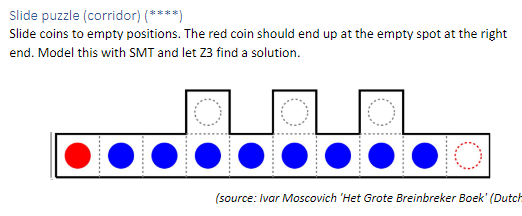

## Model
- we hebben 9 munten
- we hebben N stappen waarin we munten kunnen bewegen
- we hebben 1 bord met 13 vakken waarin de munten mogen bewegen

## Constrains

1. de munten zijn ten aller tijden (op iedere stap) uniek
2. de start locaties voor ronde 1 per munt zijn bekend en gegeven
3. per stap mag 1 munt bewegen van zijn huidige locatie naar een nieuwe locatie op het bord, zolang als ...
    1. de locatie aan de huidige locatie zit
    2. er geen andere munt op de nieuwe locatie aanwezig is
4. 